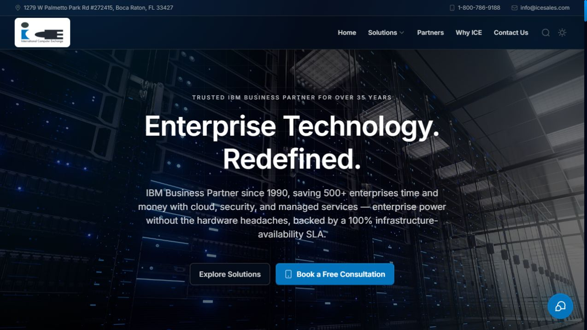
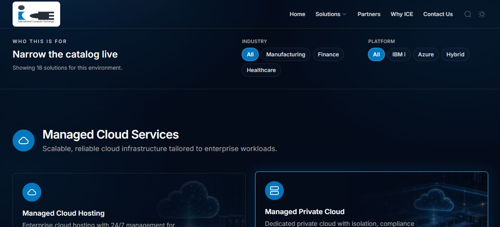
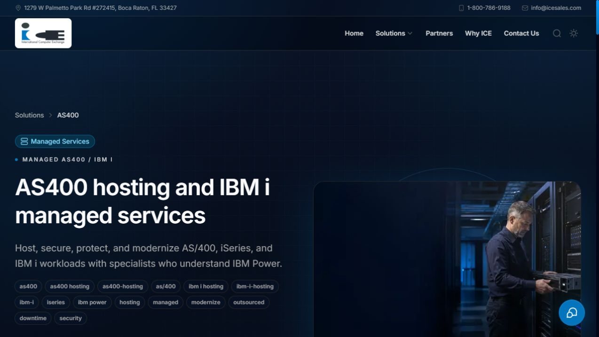
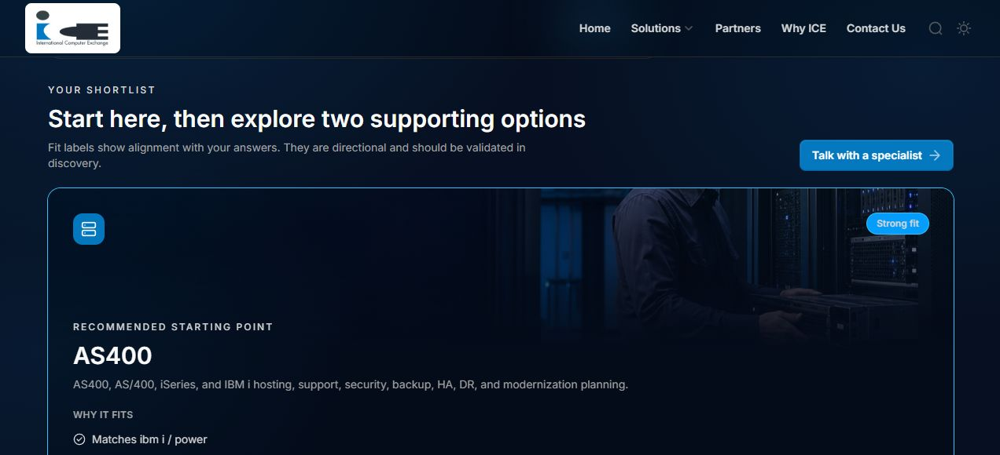

# International Computer Exchange Website

[](https://github.com/MDCran/ice-website/actions/workflows/security-checks.yml) [](https://github.com/MDCran/ice-website/actions/workflows/codeql.yml)

The public website, solutions catalog, guided solution finder, and live CMS for International Computer Exchange.

## Website preview

Screenshots below are from the live sandbox site at [sandbox.icesales.com](https://sandbox.icesales.com/).

### Homepage



### Solutions catalog



### AS400 and IBM i managed services



### Guided solution finder



## Getting Started

First, run the development server:

```bash
npm run dev
# or
yarn dev
# or
pnpm dev
# or
bun dev
```

Open [http://localhost:3000](http://localhost:3000) with your browser to see the result.

Public routes live under `src/app/(public)`. The page auto-updates as you edit the source files.

## Admin access

The deployed admin login is [sandbox.icesales.com/admin/login](https://sandbox.icesales.com/admin/login). To safely reset the demo administrator from a trusted local checkout, run:

```bash
npm run admin:reset-password -- --email admin-demo@icesales.com
```

The command reads the local Supabase configuration from `.env.local`, generates a strong temporary password, verifies it, and prints it once. It does not delete administrators or store the password. Change the temporary password immediately under **Admin Center → Settings**.

Resetting any other address is blocked; manage personal administrators in the Admin Center instead. Omit `--password` whenever possible so a chosen password is not retained in shell history.

### Client access pages

Open **Admin Center → Access Pages** to create or duplicate a client proposal, edit every section, choose its hero media, attach a PDF from private storage, and set the page to Draft, Active, or Archived. Each recipient can have a separately revocable link with an optional password, expiration, and maximum-open limit. Raw link secrets, passwords, and client documents must never be committed to this repository.

This project uses [`next/font`](https://nextjs.org/docs/app/building-your-application/optimizing/fonts) to automatically optimize and load [Geist](https://vercel.com/font), a new font family for Vercel.

## Learn More

To learn more about Next.js, take a look at the following resources:

- [Next.js Documentation](https://nextjs.org/docs) - learn about Next.js features and API.
- [Learn Next.js](https://nextjs.org/learn) - an interactive Next.js tutorial.

You can check out [the Next.js GitHub repository](https://github.com/vercel/next.js) - your feedback and contributions are welcome!

## Deploy on Vercel

The easiest way to deploy your Next.js app is to use the [Vercel Platform](https://vercel.com/new?utm_medium=default-template&filter=next.js&utm_source=create-next-app&utm_campaign=create-next-app-readme) from the creators of Next.js.

Check out our [Next.js deployment documentation](https://nextjs.org/docs/app/building-your-application/deploying) for more details.
